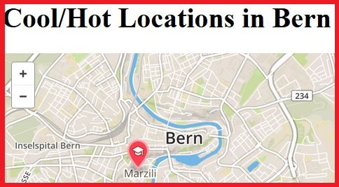

<!-- adapted from: https://gist.github.com/fvcproductions/1bfc2d4aecb01a834b46 -->

# GeoJSON Example for ***Web Technology*** Classes

> Topic: "Cool & Hot Locations in Bern"

**Hands-On Example**

1. Download HTML file and JSON file (.js)
2. Loading HTML file in Web Browser should render a map similar to the above one
3. Study and analyze GeoJSON records (.js file)
4. Develop a POI of your choice as GeoJSON record (about a cool or hot location you know about)
   Cool marker icons are here: https://www.mapbox.com/maki/ 
5. Test your record, i.e. include it in your .js file locally and refresh browser
6. If successful:
 a) in case you are a collaborator of this github repository: upload the .js file
 b) otherwise: send it to the creator of this github repository
 
---

**Information & Facts**

- used since 2015 as classroom assignment
- updated regularly
- used @ BUAS (Bern/CH), HAMK (Hämeenlinna/FI), ISEG (Lisboa/PT), HS-H (Hannover/D), UEK (Kraków/PL)

---

## License

- **[MIT license](http://opensource.org/licenses/mit-license.php)**
